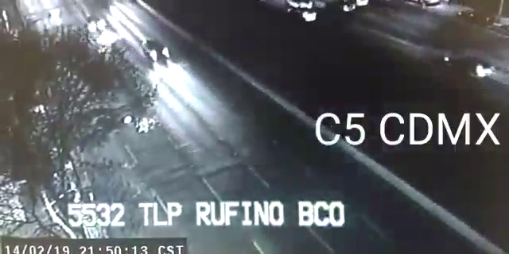

For some reason, Rekognition sees water in this
[video](https://twitter.com/C5_CDMX/status/1096256848221663232).

We tweak a [script from the
docs](https://docs.aws.amazon.com/rekognition/latest/dg/video-analyzing-with-sqs.html)
to filter for *water*, *sea*, and *ocean* labels. [This](./label-detection.py)
is the script, and this is its output:

``` javascript
{
  'Label': {
    'Confidence': 50.951255798339844,
    'Instances': [],
    'Name': 'Ocean',
    'Parents': [
      {'Name': 'Outdoors'},
      {'Name': 'Water'},
      {'Name': 'Nature'}
    ]
  },
  'Timestamp': 1385
}
{
  'Label': {
    'Confidence': 50.951255798339844,
    'Instances': [],
    'Name': 'Sea',
    'Parents': [
      {'Name': 'Outdoors'},
      {'Name': 'Water'},
      {'Name': 'Nature'}
    ]
  },
  'Timestamp': 1385
}
{
  'Label': {
    'Confidence': 50.951255798339844,
    'Instances': [],
    'Name': 'Water',
    'Parents': []
  },
  'Timestamp': 1385
}
```

We use a local version of the video generated with `youtube-dl`.

Seeing as, according to the script these labels only appear at the 1385
millisecond mark, maybe we could think of it as an outlier, or as apophenia. It
may also be worth noting that Rekognition itself isn't sure as it states a
_confidence_ of around 51%.

We have used the `ffmpeg -ss 00:00:01.385 -i 1096256848221663232.mp4 -frames:v
1 1385.png` invocation of `ffmpeg` to extract the 1385 ms frame:



We are using `boto3 1.9.99`, `youtube-dl 2019.2.18` and `ffmpeg
N-93028-gd8ebfd1bdf`.
